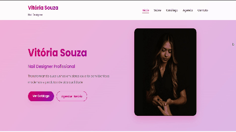

Vitória Nail Design
-----------

📌 Visão Geral
---------
Site institucional desenvolvido para apresentar os serviços de alongamento de unhas, nail art e design profissional. O projeto destaca a identidade visual da marca, informações de contato, galeria de trabalhos e uma interface moderna e responsiva.

🛠 Tecnologias Utilizadas
------
Front-end: HTML5, CSS3, JavaScript

Back-end: Python (Flask)

Banco de Dados: SQLite

Ferramentas: Git, Responsive Design, APIs de Integração
------
✨ Recursos Principais
Design Responsivo - Experiência adaptada a celular, tablet e desktop

Galeria de Trabalhos - Exibição visual dos serviços realizados

Seção Sobre - Informações sobre a profissional e diferenciais

Formulário de Contato - Comunicação direta com clientes

Integração com Redes Sociais - Acesso rápido ao Instagram/WhatsApp

## 📽 Demonstração
<p align="center">
  
</p>


<p align="center">
  <video src="video/vitoria-nail.mp4" autoplay muted playsinline width="100%">
    Seu navegador não suporta a tag de vídeo HTML5.
  </video>
</p>


---

## 🔗 Link da Aplicação

Acesse o site online agora mesmo:

👉 https://vitoria-nail-design.onrender.com

📦 Estrutura de Arquivos
--------
```text
vitoria-nail-design/
├── index.html          # Página principal
├── styles.css          # Estilos do site
├── script.js           # Interações e lógicas
├── imagens/            # Galeria e recursos visuais
├── video/              # Vídeos demonstrativos
└── favicon.ico         # Ícone do site
